# 🌾 SolaYield - Decentralized Yield Farming & Trading Protocol


**SolaYield** is a comprehensive DeFi protocol built on Solana that combines yield farming strategies with a secondary marketplace for trading yield-bearing tokens. Users can deposit assets into yield-generating strategies and trade their yield tokens for enhanced liquidity and flexibility.


## 🚀 Key Features

### 🌾 Yield Farming
- **Multiple Strategies**: Create and manage various yield farming strategies with different APYs
- **Flexible Deposits**: Deposit SOL, USDC, or other supported tokens
- **Yield Tokens**: Receive tradeable yield tokens (ySolana, yUSDC) representing your farming position
- **Continuous Rewards**: Claim accumulated yield at any time
- **Principal Protection**: Withdraw your original deposit whenever needed


### 🏪 Trading Marketplace
- **Secondary Market**: Trade yield tokens with other users
- **Order Book**: Place buy/sell orders with custom pricing
- **Instant Liquidity**: Execute trades immediately when orders match
- **Price Discovery**: Real-time best bid/ask pricing


### 🔒 Security & Governance
- **Admin Controls**: Strategy creation and marketplace management
- **Validation**: Comprehensive account and parameter validation
- **Audit-Ready**: Clean, well-documented code structure
- **Upgradeable**: Modular design for future enhancements

## 🏗️ Architecture

### Contract Structure Overview

The SolaYield protocol follows a clear separation between **data storage** (`state/`) and **business logic** (`instructions/`), providing a robust and maintainable architecture.

```mermaid
graph TB
    subgraph "📦 SMART CONTRACT ARCHITECTURE"
        subgraph "🗄️ STATE (Data Storage)"
            Strategy["🎯 Strategy<br/>• admin: Pubkey<br/>• underlying_token: Pubkey<br/>• yield_token_mint: Pubkey<br/>• name: String<br/>• apy: u64<br/>• total_deposits: u64<br/>• is_active: bool"]
            
            UserPosition["👤 UserPosition<br/>• user: Pubkey<br/>• strategy: Pubkey<br/>• deposited_amount: u64<br/>• yield_tokens_minted: u64<br/>• deposit_time: i64<br/>• last_yield_claim: i64"]
            
            Marketplace["🏪 Marketplace<br/>• admin: Pubkey<br/>• strategy: Pubkey<br/>• yield_token_mint: Pubkey<br/>• best_bid_price: u64<br/>• best_ask_price: u64<br/>• trading_fee_bps: u16"]
            
            TradeOrder["📋 TradeOrder<br/>• user: Pubkey<br/>• marketplace: Pubkey<br/>• order_type: u8<br/>• yield_token_amount: u64<br/>• price_per_token: u64<br/>• is_active: bool"]
        end
        
        subgraph "⚙️ INSTRUCTIONS (Business Logic)"
            CreateStrategy["create_strategy()<br/>📝 Create new yield strategy"]
            DepositToStrategy["deposit_to_strategy()<br/>💰 Deposit tokens & mint yield tokens"]
            ClaimYield["claim_yield()<br/>🎁 Claim accumulated rewards"]
            WithdrawFromStrategy["withdraw_from_strategy()<br/>🏦 Withdraw principal amount"]
            
            CreateMarketplace["create_marketplace()<br/>🏪 Setup trading marketplace"]
            PlaceOrder["place_order()<br/>📋 Place buy/sell orders"]
            ExecuteTrade["execute_trade()<br/>🔄 Execute matching orders"]
            CancelOrder["cancel_order()<br/>❌ Cancel existing orders"]
        end
    end
    
    %% Data Creation/Updates
    CreateStrategy -.->|"Creates"| Strategy
    DepositToStrategy -.->|"Creates/Updates"| UserPosition
    CreateMarketplace -.->|"Creates"| Marketplace
    PlaceOrder -.->|"Creates"| TradeOrder
    
    %% Relationships
    UserPosition -.->|"belongs to"| Strategy
    Marketplace -.->|"trades tokens from"| Strategy
    TradeOrder -.->|"placed in"| Marketplace
    
    style Strategy fill:#e1f5fe
    style UserPosition fill:#f3e5f5
    style Marketplace fill:#e8f5e8
    style TradeOrder fill:#fff3e0
```




### Smart Contract Structure
```
programs/contracts/
├── src/
│   ├── lib.rs              # Main program entry point
│   ├── error.rs            # Custom error definitions
│   ├── state/              # Data structures (on-chain storage)
│   │   ├── strategy.rs     # Yield farming strategy accounts
│   │   ├── user_position.rs # User position tracking
│   │   ├── marketplace.rs  # Trading marketplace accounts
│   │   └── mod.rs
│   └── instructions/       # Business logic handlers
│       ├── create_strategy.rs
│       ├── deposit_to_strategy.rs
│       ├── claim_yield.rs
│       ├── withdraw_from_strategy.rs
│       ├── redeem_yield_tokens.rs
│       ├── create_marketplace.rs
│       ├── place_order.rs
│       ├── execute_trade.rs
│       ├── cancel_order.rs
│       └── mod.rs
```

### Frontend Application
```
solayield-app/
├── src/
│   ├── app/                # Next.js 13+ app directory
│   │   ├── dashboard/      # User dashboard
│   │   ├── marketplace/    # Trading interface
│   │   ├── staking/        # Yield farming interface
│   │   └── layout.tsx
│   ├── components/         # React components
│   │   ├── Dashboard/      # Position cards, stats
│   │   ├── Marketplace/    # Order forms, token cards
│   │   ├── Staking/        # Stake forms
│   │   ├── Wallet/         # Wallet integration
│   │   └── UI/            # Common UI components
│   ├── contexts/          # React contexts
│   ├── services/          # API services
│   └── types/             # TypeScript types
```

## 🛠️ Technology Stack

### Backend (Smart Contract)
- **Anchor Framework**: Solana smart contract development
- **Rust**: Systems programming language
- **Solana Program Library (SPL)**: Token standards and utilities

### Frontend
- **Next.js 15**: React framework with app directory
- **TypeScript**: Type-safe development
- **Tailwind CSS**: Utility-first CSS framework
- **Solana Wallet Adapter**: Wallet integration
- **Heroicons**: Icon library

### Development Tools
- **Anchor CLI**: Build, test, and deploy
- **Solana CLI**: Blockchain interaction
- **TypeScript**: Development and testing
- **Mocha/Chai**: Testing framework

## 🚀 Quick Start

### Prerequisites
- **Node.js** (v18 or higher)
- **Rust** (latest stable)
- **Solana CLI** (v1.14+)
- **Anchor CLI** (v0.31.1)
- **Yarn** package manager

### Installation

1. **Clone the repository**
```bash
git clone https://github.com/your-username/solayield.git
cd solayield
```

2. **Install dependencies**
```bash
# Install root dependencies
yarn install

# Install frontend dependencies
cd solayield-app
yarn install
cd ..
```

3. **Setup Solana environment**
```bash
# Configure Solana CLI for devnet
solana config set --url devnet

# Create a devnet wallet (if you don't have one)
solana-keygen new --outfile ~/.config/solana/devnet.json

# Request devnet SOL
solana airdrop 2
```

4. **Build the smart contract**
```bash
anchor build
```

5. **Deploy to devnet**
```bash
anchor deploy
```

6. **Run the frontend**
```bash
cd solayield-app
yarn dev
```

Visit `http://localhost:3000` to access the application.


## 📋 Usage

### For Yield Farmers

1. **Connect Wallet**: Use Phantom or other supported wallets
2. **Browse Strategies**: View available yield farming strategies
3. **Deposit Tokens**: Deposit SOL, USDC, or other supported assets
4. **Receive Yield Tokens**: Get tradeable tokens representing your position
5. **Claim Rewards**: Collect accumulated yield periodically
6. **Withdraw Principal**: Remove your original deposit at any time


### For Traders

1. **Access Marketplace**: Navigate to the trading section
2. **View Order Book**: See current buy/sell orders
3. **Place Orders**: Set your desired price and quantity
4. **Execute Trades**: Trade with existing orders instantly
5. **Manage Positions**: Monitor your yield token portfolio


### For Administrators

1. **Create Strategies**: Set up new yield farming opportunities
2. **Manage Markets**: Initialize trading marketplaces
3. **Monitor Protocol**: Track total value locked and activity

## 🧪 Testing

### Run Unit Tests
```bash
# Test smart contracts
anchor test

# Run specific test files
yarn test:unit

# Syntax validation
yarn test:syntax
```

### Local Development
```bash
# Start local validator
yarn localnet

# In another terminal, run tests
anchor test --provider.cluster localnet
```

## 📊 Smart Contract Instructions

### Yield Farming
- `initialize_protocol()` - Initialize the SolaYield protocol
- `create_strategy()` - Create a new yield farming strategy
- `deposit_to_strategy()` - Deposit tokens into a strategy
- `claim_yield()` - Claim accumulated yield rewards
- `withdraw_from_strategy()` - Withdraw principal amount
- `redeem_yield_tokens()` - Exchange yield tokens for underlying assets

### Trading Marketplace
- `create_marketplace()` - Create a trading marketplace for a strategy
- `place_order()` - Place buy or sell orders
- `execute_trade()` - Execute matching orders
- `cancel_order()` - Cancel existing orders

## 🔧 Configuration

### Environment Variables
```env
# Solana Configuration
SOLANA_NETWORK=devnet
ANCHOR_PROVIDER_URL=https://api.devnet.solana.com

# Frontend Configuration
NEXT_PUBLIC_SOLANA_NETWORK=devnet
NEXT_PUBLIC_PROGRAM_ID=BCz6K4XSaycH954PhZPPmwuistSyJP5p5Biya7frA2Az
```

### Anchor Configuration
See `Anchor.toml` for program IDs and cluster settings.

## 🚢 Deployment

### Devnet Deployment
```bash
# Build and deploy
anchor build
anchor deploy --provider.cluster devnet

# Update program ID in frontend
# Update NEXT_PUBLIC_PROGRAM_ID in your environment
```

### Mainnet Deployment
```bash
# Configure for mainnet
solana config set --url mainnet-beta

# Deploy (ensure you have enough SOL for deployment)
anchor deploy --provider.cluster mainnet-beta
```

## 📝 Scripts

- `yarn test` - Run all tests
- `yarn build` - Build the smart contract
- `yarn deploy` - Deploy to configured cluster
- `yarn interact` - Run interaction scripts
- `yarn simple` - Run simple interaction examples
- `yarn solayield` - Run the full SolaYield demo
- `yarn init` - Initialize the protocol

## 🤝 Contributing

1. **Fork the repository**
2. **Create a feature branch**: `git checkout -b feature/amazing-feature`
3. **Commit changes**: `git commit -m 'Add amazing feature'`
4. **Push to branch**: `git push origin feature/amazing-feature`
5. **Open a Pull Request**

### Development Guidelines
- Follow Rust and TypeScript best practices
- Add tests for new features
- Update documentation as needed
- Ensure all tests pass before submitting

## 📄 License

This project is licensed under the ISC License. See the [LICENSE](LICENSE) file for details.

## 📁 Documentation Assets

For the images referenced in this documentation, create the following folder structure:

```
docs/
└── images/
    ├── homepage.png                    # SolaYield homepage screenshot
    ├── staking-interface.png           # Yield farming interface
    ├── marketplace-interface.png       # Trading marketplace interface
    ├── contract-architecture.png       # Contract architecture diagram
    ├── user-dashboard.png              # User dashboard screenshot
```

## 🔗 Links

- **Program ID**: `BCz6K4XSaycH954PhZPPmwuistSyJP5p5Biya7frA2Az`
- **Solana Explorer**: [View on Solana Explorer](https://explorer.solana.com/address/BCz6K4XSaycH954PhZPPmwuistSyJP5p5Biya7frA2Az?cluster=devnet)
- **Documentation**: [Full Documentation](./docs/)

## 🆘 Support

If you encounter any issues or have questions:

1. Check the [Issues](https://github.com/your-username/solayield/issues) page
2. Create a new issue with detailed information
3. Join our community discussions

---

**Built with ❤️ on Solana**

*SolaYield - Empowering DeFi with yield farming and trading innovation* 