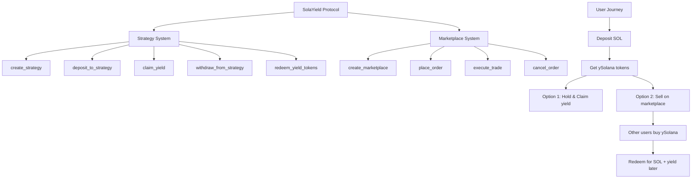

# 🌟 SolaYield Protocol

[](https://solana.com)
[](https://anchor-lang.com)
[](https://www.typescriptlang.org/)
[](#)
[](#)

> **Décentralized Yield Tokenization & Trading Protocol on Solana**

SolaYield permet aux utilisateurs de déposer des actifs dans des stratégies de rendement et de recevoir des **Yield Tokens** (ySolana, yUSDC, etc.) qu'ils peuvent échanger sur une marketplace décentralisée.

---

## 📖 Table des Matières

- [🎯 Overview](#-overview)
- [🏗️ Architecture](#️-architecture)
- [🚀 Quick Start](#-quick-start)
- [📋 API Documentation](#-api-documentation)
  - [Protocol Instructions](#protocol-instructions)
  - [Marketplace Instructions](#marketplace-instructions)
- [💻 Frontend Integration](#-frontend-integration)
- [🎮 Usage Examples](#-usage-examples)
- [🔧 Development](#-development)
- [📊 Data Structures](#-data-structures)
- [⚠️ Security Notes](#️-security-notes)

---

## 🎯 Overview

### Problème Résolu
- ❌ **Liquidité limitée** : Users bloqués jusqu'à maturité des investissements
- ❌ **Pas de trading** : Impossible d'échanger positions yield entre users  
- ❌ **Prix discovery** : Pas de mécanisme de prix pour futures rendements

### Solution SolaYield
- ✅ **Yield Tokenization** : Convertit rendements en tokens ERC-20-like
- ✅ **Marketplace P2P** : Trading décentralisé des Yield Tokens
- ✅ **Liquidité immédiate** : Vente instantanée des positions yield
- ✅ **Price Discovery** : Orderbook automatique avec best bid/ask

### Business Model
```
User A: Vend ySolana pour liquidité immédiate (discount)
User B: Achète ySolana pour rendement futur (premium)  
Protocol: Gagne fees de trading + management
```

---

## 🏗️ Architecture

### Core Components



### Program ID
```
BCz6K4XSaycH954PhZPPmwuistSyJP5p5Biya7frA2Az
```

---

## 🚀 Quick Start

### Installation

```bash
# Clone le repository
git clone <repo-url>
cd SolaYield/contracts

# Install dependencies
yarn install

# Build le programme
anchor build

# Run tests
anchor test
```

### Frontend Setup

```typescript
import * as anchor from "@coral-xyz/anchor";
import { Connection, PublicKey } from "@solana/web3.js";
import { TOKEN_PROGRAM_ID } from "@solana/spl-token";

// Connection setup
const connection = new Connection("https://api.devnet.solana.com");
const wallet = /* your wallet adapter */;
const provider = new anchor.AnchorProvider(connection, wallet, {});
anchor.setProvider(provider);

// Load program
const programId = new PublicKey("BCz6K4XSaycH954PhZPPmwuistSyJP5p5Biya7frA2Az");
const program = new anchor.Program(idl, programId, provider);
```

---

## 📋 API Documentation

### Protocol Instructions

#### 1. Initialize Protocol
```typescript
/**
 * Initialize le protocole SolaYield (admin only, one-time)
 */
await program.methods
  .initializeProtocol()
  .accounts({
    admin: adminWallet.publicKey,
    strategyCounter: strategyCounterPda,
    systemProgram: SystemProgram.programId,
    rent: SYSVAR_RENT_PUBKEY,
  })
  .signers([adminWallet])
  .rpc();
```

#### 2. Create Strategy
```typescript
/**
 * Crée une nouvelle stratégie de yield (admin only)
 * @param name - Nom de la stratégie (max 64 chars)
 * @param apyBasisPoints - APY en basis points (1000 = 10%)
 * @param strategyId - ID unique de la stratégie
 */
await program.methods
  .createStrategy(
    "Solana Staking Strategy",
    1000, // 10% APY
    new anchor.BN(0) // Strategy ID
  )
  .accounts({
    admin: adminWallet.publicKey,
    strategy: strategyPda,
    strategyCounter: strategyCounterPda,
    underlyingToken: solMint,
    yieldTokenMint: yieldTokenMintPda,
    tokenProgram: TOKEN_PROGRAM_ID,
    systemProgram: SystemProgram.programId,
    rent: SYSVAR_RENT_PUBKEY,
  })
  .signers([adminWallet])
  .rpc();
```

#### 3. Deposit to Strategy
```typescript
/**
 * Dépose des tokens dans une stratégie et reçoit des yield tokens
 * @param amount - Montant à déposer (en unités du token)
 * @param strategyId - ID de la stratégie cible
 */
await program.methods
  .depositToStrategy(
    new anchor.BN(1000 * 10**6), // 1000 tokens
    new anchor.BN(0) // Strategy ID
  )
  .accounts({
    user: userWallet.publicKey,
    strategy: strategyPda,
    userPosition: userPositionPda,
    underlyingTokenMint: solMint,
    userUnderlyingToken: userSolAccount,
    strategyVault: strategyVaultPda,
    yieldTokenMint: yieldTokenMintPda,
    userYieldTokenAccount: userYieldTokenAccount,
    tokenProgram: TOKEN_PROGRAM_ID,
    associatedTokenProgram: ASSOCIATED_TOKEN_PROGRAM_ID,
    systemProgram: SystemProgram.programId,
    rent: SYSVAR_RENT_PUBKEY,
  })
  .signers([userWallet])
  .rpc();
```

#### 4. Claim Yield
```typescript
/**
 * Réclame le yield accumulé (reçoit des yield tokens supplémentaires)
 * @param strategyId - ID de la stratégie
 */
await program.methods
  .claimYield(new anchor.BN(0))
  .accounts({
    user: userWallet.publicKey,
    strategy: strategyPda,
    userPosition: userPositionPda,
    yieldTokenMint: yieldTokenMintPda,
    userYieldTokenAccount: userYieldTokenAccount,
    tokenProgram: TOKEN_PROGRAM_ID,
  })
  .signers([userWallet])
  .rpc();
```

#### 5. Redeem Yield Tokens
```typescript
/**
 * Brûle yield tokens pour récupérer principal + yield accumulé
 * @param yieldTokenAmount - Nombre de yield tokens à brûler
 * @param strategyId - ID de la stratégie
 */
await program.methods
  .redeemYieldTokens(
    new anchor.BN(500 * 10**6), // 500 yield tokens
    new anchor.BN(0)
  )
  .accounts({
    user: userWallet.publicKey,
    strategy: strategyPda,
    userPosition: userPositionPda,
    strategyVault: strategyVaultPda,
    yieldTokenMint: yieldTokenMintPda,
    userYieldTokenAccount: userYieldTokenAccount,
    userUnderlyingToken: userSolAccount,
    tokenProgram: TOKEN_PROGRAM_ID,
  })
  .signers([userWallet])
  .rpc();
```

### Marketplace Instructions

#### 1. Create Marketplace
```typescript
/**
 * Crée une marketplace pour une stratégie (admin only)
 * @param strategyId - ID de la stratégie
 * @param marketplaceId - ID unique du marketplace
 * @param tradingFeeBps - Frais de trading en basis points (100 = 1%)
 */
await program.methods
  .createMarketplace(
    new anchor.BN(0), // Strategy ID
    new anchor.BN(0), // Marketplace ID
    100 // 1% trading fee
  )
  .accounts({
    admin: adminWallet.publicKey,
    strategy: strategyPda,
    marketplace: marketplacePda,
    marketplaceCounter: marketplaceCounterPda,
    yieldTokenMint: yieldTokenMintPda,
    underlyingTokenMint: solMint,
    systemProgram: SystemProgram.programId,
    rent: SYSVAR_RENT_PUBKEY,
  })
  .signers([adminWallet])
  .rpc();
```

#### 2. Place Order
```typescript
/**
 * Place un ordre BUY ou SELL sur le marketplace
 * @param orderId - ID unique de l'ordre
 * @param orderType - 0 = BUY, 1 = SELL
 * @param yieldTokenAmount - Quantité de yield tokens
 * @param pricePerToken - Prix par token (fixed-point 6 decimales)
 */
await program.methods
  .placeOrder(
    new anchor.BN(1), // Order ID
    1, // SELL order
    new anchor.BN(1000 * 10**6), // 1000 yield tokens
    new anchor.BN(950000) // 0.95 SOL per token (0.95 * 10^6)
  )
  .accounts({
    user: userWallet.publicKey,
    marketplace: marketplacePda,
    order: orderPda,
    orderCounter: orderCounterPda,
    yieldTokenMint: yieldTokenMintPda,
    underlyingTokenMint: solMint,
    userYieldTokenAccount: userYieldTokenAccount,
    userUnderlyingTokenAccount: userSolAccount,
    escrowAccount: escrowPda,
    tokenProgram: TOKEN_PROGRAM_ID,
    systemProgram: SystemProgram.programId,
    rent: SYSVAR_RENT_PUBKEY,
  })
  .signers([userWallet])
  .rpc();
```

#### 3. Execute Trade
```typescript
/**
 * Exécute un trade entre deux ordres compatibles
 * @param tradeAmount - Quantité à trader
 */
await program.methods
  .executeTrade(new anchor.BN(500 * 10**6))
  .accounts({
    executor: executorWallet.publicKey,
    marketplace: marketplacePda,
    buyOrder: buyOrderPda,
    sellOrder: sellOrderPda,
    buyOrderEscrow: buyEscrowPda,
    sellOrderEscrow: sellEscrowPda,
    buyerYieldTokenAccount: buyerYieldAccount,
    buyerUnderlyingTokenAccount: buyerSolAccount,
    sellerUnderlyingTokenAccount: sellerSolAccount,
    feeCollectionAccount: feeCollectionAccount,
    tokenProgram: TOKEN_PROGRAM_ID,
  })
  .signers([executorWallet])
  .rpc();
```

#### 4. Cancel Order
```typescript
/**
 * Annule un ordre et récupère les tokens en escrow
 * @param orderId - ID de l'ordre à annuler
 */
await program.methods
  .cancelOrder(new anchor.BN(1))
  .accounts({
    user: userWallet.publicKey,
    marketplace: marketplacePda,
    order: orderPda,
    escrowAccount: escrowPda,
    userTokenAccount: userTokenAccount,
    tokenProgram: TOKEN_PROGRAM_ID,
  })
  .signers([userWallet])
  .rpc();
```

---

## 💻 Frontend Integration

### PDA Calculation Helper

```typescript
class SolaYieldSDK {
  constructor(
    public program: anchor.Program,
    public connection: Connection
  ) {}

  // Strategy PDAs
  getStrategyPda(strategyId: number): [PublicKey, number] {
    return PublicKey.findProgramAddressSync(
      [
        Buffer.from("strategy"),
        new anchor.BN(strategyId).toArrayLike(Buffer, "le", 8)
      ],
      this.program.programId
    );
  }

  getStrategyVaultPda(strategyId: number): [PublicKey, number] {
    return PublicKey.findProgramAddressSync(
      [
        Buffer.from("strategy_vault"),
        new anchor.BN(strategyId).toArrayLike(Buffer, "le", 8)
      ],
      this.program.programId
    );
  }

  getYieldTokenMintPda(strategyId: number): [PublicKey, number] {
    return PublicKey.findProgramAddressSync(
      [
        Buffer.from("yield_token"),
        new anchor.BN(strategyId).toArrayLike(Buffer, "le", 8)
      ],
      this.program.programId
    );
  }

  getUserPositionPda(userPubkey: PublicKey, strategyPda: PublicKey): [PublicKey, number] {
    return PublicKey.findProgramAddressSync(
      [
        Buffer.from("user_position"),
        userPubkey.toBuffer(),
        strategyPda.toBuffer()
      ],
      this.program.programId
    );
  }

  // Marketplace PDAs
  getMarketplacePda(strategyPda: PublicKey): [PublicKey, number] {
    return PublicKey.findProgramAddressSync(
      [
        Buffer.from("marketplace"),
        strategyPda.toBuffer()
      ],
      this.program.programId
    );
  }

  getOrderPda(userPubkey: PublicKey, orderId: number): [PublicKey, number] {
    return PublicKey.findProgramAddressSync(
      [
        Buffer.from("order"),
        userPubkey.toBuffer(),
        new anchor.BN(orderId).toArrayLike(Buffer, "le", 8)
      ],
      this.program.programId
    );
  }

  getEscrowPda(orderPda: PublicKey): [PublicKey, number] {
    return PublicKey.findProgramAddressSync(
      [
        Buffer.from("escrow"),
        orderPda.toBuffer()
      ],
      this.program.programId
    );
  }

  // Data fetching
  async getStrategy(strategyId: number) {
    const [strategyPda] = this.getStrategyPda(strategyId);
    return await this.program.account.strategy.fetch(strategyPda);
  }

  async getUserPosition(userPubkey: PublicKey, strategyId: number) {
    const [strategyPda] = this.getStrategyPda(strategyId);
    const [userPositionPda] = this.getUserPositionPda(userPubkey, strategyPda);
    return await this.program.account.userPosition.fetch(userPositionPda);
  }

  async getMarketplace(strategyId: number) {
    const [strategyPda] = this.getStrategyPda(strategyId);
    const [marketplacePda] = this.getMarketplacePda(strategyPda);
    return await this.program.account.marketplace.fetch(marketplacePda);
  }

  async getOrder(userPubkey: PublicKey, orderId: number) {
    const [orderPda] = this.getOrderPda(userPubkey, orderId);
    return await this.program.account.tradeOrder.fetch(orderPda);
  }

  // Utility functions
  calculateYield(principal: number, apyBasisPoints: number, timeElapsed: number): number {
    const annualYield = (principal * apyBasisPoints) / 10000;
    const secondsPerYear = 365 * 24 * 60 * 60;
    return (annualYield * timeElapsed) / secondsPerYear;
  }

  formatPrice(price: number): number {
    return price / 1_000_000; // Convert from fixed-point
  }

  parsePrice(price: number): number {
    return Math.floor(price * 1_000_000); // Convert to fixed-point
  }
}
```

### React Hook Example

```typescript
import { useConnection, useWallet } from '@solana/wallet-adapter-react';
import { useQuery } from '@tanstack/react-query';

export function useSolaYield() {
  const { connection } = useConnection();
  const wallet = useWallet();
  const [sdk, setSdk] = useState<SolaYieldSDK | null>(null);

  useEffect(() => {
    if (wallet.publicKey && connection) {
      const provider = new anchor.AnchorProvider(
        connection,
        wallet as any,
        { commitment: 'confirmed' }
      );
      const program = new anchor.Program(IDL, PROGRAM_ID, provider);
      setSdk(new SolaYieldSDK(program, connection));
    }
  }, [wallet.publicKey, connection]);

  // Get user positions
  const {
    data: userPositions,
    isLoading: positionsLoading
  } = useQuery({
    queryKey: ['userPositions', wallet.publicKey?.toString()],
    queryFn: async () => {
      if (!sdk || !wallet.publicKey) return [];
      
      const positions = [];
      for (let strategyId = 0; strategyId < 10; strategyId++) {
        try {
          const position = await sdk.getUserPosition(wallet.publicKey, strategyId);
          positions.push({ strategyId, ...position });
        } catch (error) {
          // Position doesn't exist
        }
      }
      return positions;
    },
    enabled: !!sdk && !!wallet.publicKey
  });

  // Get marketplace data
  const {
    data: marketplaces,
    isLoading: marketplacesLoading
  } = useQuery({
    queryKey: ['marketplaces'],
    queryFn: async () => {
      if (!sdk) return [];
      
      const marketplaces = [];
      for (let strategyId = 0; strategyId < 10; strategyId++) {
        try {
          const marketplace = await sdk.getMarketplace(strategyId);
          const strategy = await sdk.getStrategy(strategyId);
          marketplaces.push({ 
            strategyId, 
            marketplace, 
            strategy 
          });
        } catch (error) {
          // Marketplace doesn't exist
        }
      }
      return marketplaces;
    },
    enabled: !!sdk
  });

  return {
    sdk,
    userPositions,
    marketplaces,
    isLoading: positionsLoading || marketplacesLoading
  };
}
```

---

## 🎮 Usage Examples

### Complete User Flow

```typescript
async function completeUserFlow() {
  const sdk = new SolaYieldSDK(program, connection);
  
  // 1. User deposits to strategy
  console.log("1. Depositing to strategy...");
  await program.methods
    .depositToStrategy(
      new anchor.BN(1000 * 10**6), // 1000 SOL
      new anchor.BN(0) // Strategy 0
    )
    .accounts({
      // ... accounts
    })
    .rpc();

  // 2. Wait for yield to accumulate
  console.log("2. Waiting for yield...");
  await new Promise(resolve => setTimeout(resolve, 5000));

  // 3. Claim additional yield
  console.log("3. Claiming yield...");
  await program.methods
    .claimYield(new anchor.BN(0))
    .accounts({
      // ... accounts
    })
    .rpc();

  // 4. Place sell order on marketplace
  console.log("4. Placing sell order...");
  await program.methods
    .placeOrder(
      new anchor.BN(1), // Order ID
      1, // SELL
      new anchor.BN(500 * 10**6), // 500 yield tokens
      new anchor.BN(950000) // 0.95 SOL per token
    )
    .accounts({
      // ... accounts
    })
    .rpc();

  // 5. Another user buys
  console.log("5. Executing trade...");
  await program.methods
    .executeTrade(new anchor.BN(500 * 10**6))
    .accounts({
      // ... accounts
    })
    .rpc();

  console.log("✅ Complete flow executed!");
}
```

### Price Calculation

```typescript
function calculateTradePrice(strategy: any, timeRemaining: number): number {
  const apyBasisPoints = strategy.apy;
  const annualYield = apyBasisPoints / 10000;
  
  // Calculate expected yield for remaining time
  const expectedYield = annualYield * (timeRemaining / (365 * 24 * 60 * 60));
  
  // Discount rate based on liquidity premium
  const liquidityDiscount = 0.05; // 5% discount for immediate liquidity
  
  // Price = 1 + expected_yield - liquidity_discount
  return 1 + expectedYield - liquidityDiscount;
}
```

---

## 🔧 Development

### Testing

```bash
# Run all tests
anchor test

# Run specific test
anchor test -- --grep "marketplace"

# Build only
anchor build

# Deploy to devnet
anchor deploy --provider.cluster devnet
```

### Environment Setup

```bash
# .env file
ANCHOR_PROVIDER_URL=https://api.devnet.solana.com
ANCHOR_WALLET=~/.config/solana/id.json
```

### Common Issues

1. **Account not initialized**: Ensure protocol is initialized first
2. **Insufficient funds**: Check token balances before operations
3. **PDA mismatch**: Verify seed parameters match exactly
4. **Order not fillable**: Check order status and remaining amount

---

## 📊 Data Structures

### Strategy
```typescript
interface Strategy {
  admin: PublicKey;
  underlyingToken: PublicKey;
  yieldTokenMint: PublicKey;
  name: string;
  apy: number; // basis points
  totalDeposits: number;
  isActive: boolean;
  createdAt: number;
  totalYieldTokensMinted: number;
  strategyId: number;
}
```

### UserPosition
```typescript
interface UserPosition {
  user: PublicKey;
  strategy: PublicKey;
  depositedAmount: number;
  yieldTokensMinted: number;
  depositTime: number;
  lastYieldClaim: number;
  totalYieldClaimed: number;
  positionId: number;
}
```

### Marketplace
```typescript
interface Marketplace {
  admin: PublicKey;
  strategy: PublicKey;
  yieldTokenMint: PublicKey;
  underlyingTokenMint: PublicKey;
  totalVolume: number;
  totalTrades: number;
  bestBidPrice: number;
  bestAskPrice: number;
  tradingFeeBps: number;
  isActive: boolean;
  createdAt: number;
  marketplaceId: number;
}
```

### TradeOrder
```typescript
interface TradeOrder {
  user: PublicKey;
  marketplace: PublicKey;
  orderType: number; // 0 = BUY, 1 = SELL
  yieldTokenAmount: number;
  pricePerToken: number; // fixed-point 6 decimals
  totalValue: number;
  filledAmount: number;
  isActive: boolean;
  createdAt: number;
  orderId: number;
}
```

---

## ⚠️ Security Notes

### Best Practices

1. **Always verify PDAs**: Check that computed PDAs match expected addresses
2. **Check account ownership**: Ensure accounts belong to the correct program
3. **Validate token mints**: Verify token mints match strategy configuration
4. **Handle errors gracefully**: Implement proper error handling for all operations
5. **Use confirmed commitment**: Wait for transaction confirmation before proceeding

### Common Vulnerabilities

- ❌ **PDA collision**: Using weak seeds
- ❌ **Account substitution**: Not verifying account addresses
- ❌ **Integer overflow**: Not checking arithmetic operations
- ❌ **Reentrancy**: Multiple calls to same instruction

### Mitigations Implemented

- ✅ **Constraint validation**: Anchor constraints prevent common attacks
- ✅ **Bump verification**: All PDAs use verified bumps
- ✅ **Authority checks**: Only authorized users can perform actions
- ✅ **Escrow mechanism**: Secure token custody during trading

---

## 🤝 Contributing

1. Fork the repository
2. Create your feature branch (`git checkout -b feature/amazing-feature`)
3. Commit your changes (`git commit -m 'Add amazing feature'`)
4. Push to the branch (`git push origin feature/amazing-feature`)
5. Open a Pull Request

---

## 📄 License

This project is licensed under the MIT License - see the [LICENSE](LICENSE) file for details.

---

## 🆘 Support

- **Documentation**: [docs.solayield.com](https://docs.solayield.com)
- **Discord**: [discord.gg/solayield](https://discord.gg/solayield)
- **GitHub Issues**: [Report bugs here](https://github.com/solayield/issues)
- **Email**: dev@solayield.com

---

**Made with ❤️ by the SolaYield Team** 